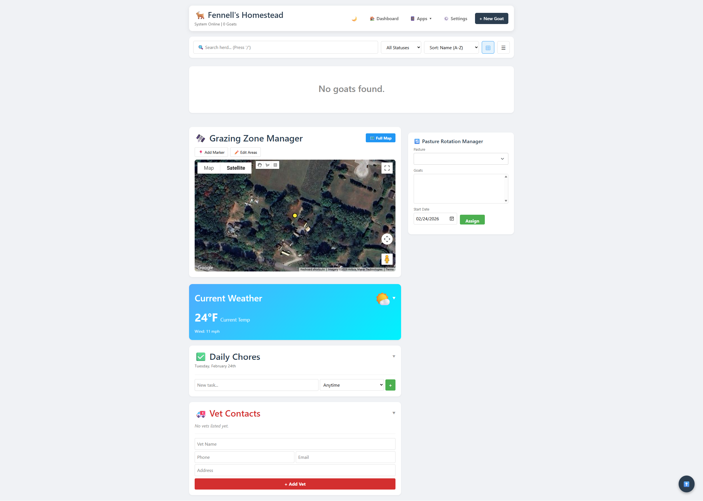

# GoatOS - Farm Management System


GoatOS is an open-source farm management platform designed for goat herds. Optimized for barn use with a mobile-friendly **Dark Mode**, it tracks animal health, pedigrees, weight, milk production, breeding, and finances. Features include medical records with dosage calculators, a sales ledger, satellite grazing maps with advanced tools, real-time weather, and a full-featured CRM. Built on **Python/Django** and **Docker**, GoatOS provides a secure, all-in-one dashboard for modern herd management.



---

## Key Features

### Dashboard & Analytics
- **At-a-Glance Stats:** Real-time herd counts, active sales, and task reminders
- **Weather Widget:** Integrated Open-Meteo API for real-time farm weather (no API key required)
- **Dark Mode:** Fully responsive UI with toggleable Dark Mode for low-light barn checks
- **Smart Alerts:** Low feed stock warnings, overdue medical schedules, due date reminders
- **Activity Feed:** Chronological log of all farm actions across the system
- **Herd Analytics:** Breed/gender/status distribution charts, age demographics, weight trends

### Herd Management
- **Individual Profiles:** Track age, breed, gender, bio, and status (Healthy, Sick, At Vet, Deceased)
- **Pedigree Tracking:** Visual lineage trees linking Sires and Dams
- **Photo Gallery:** Upload and manage photos for each animal
- **Stall Cards:** Generate printable stall cards with identifying info
- **Document Vault:** Attach registration papers, vet records, and other documents to each goat
- **Barn & Pen Management:** Assign goats to physical pens with capacity tracking

### Health & Medical
- **Medical Records:** Log vaccinations, deworming, illness, and treatments
- **Medical Schedules:** Set recurring vaccination/deworming schedules with due date alerts
- **FAMACHA & Body Condition Scoring:** Track parasite load and body condition over time
- **Health Scores Dashboard:** Herd-wide health monitoring with trend charts
- **Dosage Calculator:** Built-in calculator for medication volume based on weight and dosage rate
- **Weight Tracking:** Log weights and visualize growth with interactive Chart.js graphs
- **Medicine Cabinet:** Track medicine inventory, expiration dates, and withdrawal periods

### Breeding & Kidding
- **Breeding Records:** Log breeding events with sire/dam tracking
- **Gestation Calculator:** Estimate kidding dates based on breeding logs
- **Heat Detection:** Track estrus observations and predict next heat cycles
- **Kidding Records:** Document births including kids born, complications, and outcomes
- **Kidding Season Dashboard:** Overview of upcoming due dates and recent births

### Production & Sales
- **Milk Log:** Track daily yields per goat with quick-log from dashboard
- **Sales Ledger:** Record sales with customer info, deposits, and payment status
- **Customer CRM:** Manage customer contacts, purchase history, and waiting lists
- **Meat Locker:** Track meat harvests and inventory
- **Financial Dashboard:** Income/expense tracking with monthly trend charts
- **Cost-Per-Goat Analysis:** Break down expenses by individual animal
- **CSV Exports:** Export goats, finances, milk logs, and medical records

### Mapping & Grazing
- **Satellite Grazing Map:** Google Maps integration to draw and manage grazing zones
- **Dedicated Full-Screen Map:** Expanded map page with all power tools
- **Perimeter Calculator:** Automatic fencing length calculation for each area
- **Stocking Rate Calculator:** Recommended goat capacity based on acreage and condition
- **Heat Map Overlay:** Color areas by pasture condition score (red to green)
- **Water Source Radius:** Toggle 100m coverage circles for water troughs
- **Walking Path Tool:** Click-to-measure distances on the map
- **Condition History Sparklines:** Mini charts showing pasture condition trends in InfoWindows
- **Area Name/Color Editing:** Edit pasture names and colors directly from map InfoWindows
- **Map Type Toggle:** Switch between Satellite, Terrain, Road, and Hybrid views
- **Pasture Rotation Manager:** Assign goats to pastures, track rotation history
- **Rotation Timeline:** Visual 90-day timeline of grazing assignments
- **Pasture Condition Scoring:** Rate pasture quality (1-5) with historical tracking
- **Map Markers:** Place and categorize landmarks (Barn, Shelter, Water, Feeder, Gate)
- **KML Export:** Download grazing areas for Google Earth and other GIS tools

### Supplier & Inventory
- **Supplier Database:** Track feed suppliers, vets, and equipment vendors
- **Silo & Feed Management:** Monitor feed inventory with low-stock alerts

### Calendar & Tasks
- **Farm Calendar:** Full calendar with drag-and-drop event management
- **Daily Checklists:** Morning, afternoon, and evening task lists with AJAX toggles
- **Task Management:** Create recurring tasks tied to time of day

### Tools & Utilities
- **Tools Dashboard:** Centralized access to calculators and utilities
- **Database Backup/Restore:** One-click backup and restore through the UI
- **Media Backup:** Separate backup for uploaded photos and documents
- **PIN Gate:** Simple PIN-based access control for shared farm devices
- **PWA Support:** Install as a Progressive Web App on mobile devices

---

## Tech Stack

- **Backend:** Python 3.11, Django 5.x
- **Frontend:** HTML5, CSS3 (Bootstrap 5), Vanilla JavaScript
- **Database:** SQLite (default, swappable for Postgres)
- **Charts:** Chart.js
- **Maps:** Google Maps JavaScript API (Drawing + Geometry libraries)
- **Containerization:** Docker

---

## Quick Start (Docker Hub)

Pull and run directly from Docker Hub — no build required:

```bash
docker pull fennch/goatos:latest
docker run -d --name goatos_app -p 4321:4321 \
  -v goatos_db:/app/db.sqlite3 \
  -v goatos_media:/app/media \
  fennch/goatos:latest
```

Access at: `https://localhost:4321`

---

## Docker Installation (From Source)

### Prerequisites
- Docker
- Docker Compose

### 1) Clone & Run
```bash
git clone https://github.com/chrisdfennell/goatos.git
cd goatos
docker-compose up -d
```

This builds from source and starts the container.

### 2) Helper Scripts (Quick Rebuild)
- **Linux/Mac:** `./rebuild.sh`
- **Windows:** `rebuild.bat`

The application launches on port **4321** with **SSL enabled** (via `django-sslserver`) to support secure features like camera access on mobile devices.

### 3) Access
```
https://localhost:4321
# OR
https://YOUR_SERVER_IP:4321
```

> **Note:** The Docker container automatically handles database migrations on startup.
> To reset the database, delete the `db.sqlite3` file on your host machine and restart the container.

---

## Manual Installation (Local Dev)

```bash
pip install -r requirements.txt
python manage.py migrate
python manage.py createsuperuser
python manage.py runsslserver 0.0.0.0:4321
```

---

## Configuration

Configure via the Admin Panel (`/admin/`) or environment variables.

### Key Settings
- **Farm Settings:** Set Farm Name, Latitude, and Longitude in the Admin panel to calibrate the Weather widget and Map center
- **Google Maps API:** Add your API key in Farm Settings to enable the Grazing Map and Location Picker
- **PIN Access:** Set a farm PIN in the Admin panel to enable PIN gate protection

### Google Maps API Setup

The satellite map and grazing tools require a Google Maps API key. Follow these steps:

1. Go to [Google Cloud Console](https://console.cloud.google.com/)
2. Create a new project (or select an existing one)
3. Go to **APIs & Services > Library** and enable these APIs:
   - **Maps JavaScript API** (required)
4. Go to **APIs & Services > Credentials** and create an API key
5. (Optional) Under **API key restrictions**, add your server's domain/IP as an HTTP referrer
6. **Enable Billing** on the project — Google provides $200/month free credit, which is more than enough for personal use. Without billing enabled, the map will show a "For development purposes only" watermark
7. Paste the API key into **Farm Settings > Google Maps API Key** within GoatOS

---

## Troubleshooting

### Forgot Admin Password?
```bash
# Reset password for existing user
docker exec -it goatos_app python manage.py changepassword admin

# Or create a new admin user
docker exec -it goatos_app python manage.py createsuperuser
```

> Use `docker ps` to find your container name if it differs from `goatos_app`.

---

## Contributing

Contributions are welcome! Please feel free to submit a Pull Request.
